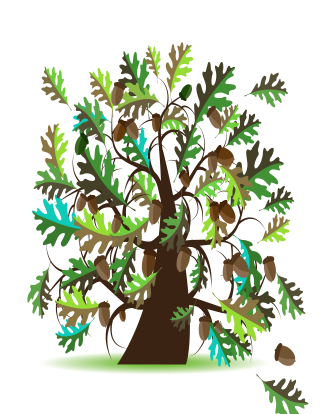

The 2022 Arbor Vista Association Annual  Meeting is coming up soon

===
# details@ https://bit.ly/ava2022

- Date & Time: 10:00 am  Saturday January 29th with coffee, orange, and donuts available at 9:00am. at the Arbor Vista Bulletin Board 
- Guest speaker: "Dark Secrets of the Almond Marsh"  Ken Klick, Lake County Forest Preserve Ecologist
- Questions?  send email to ava@arborvista.org

===

