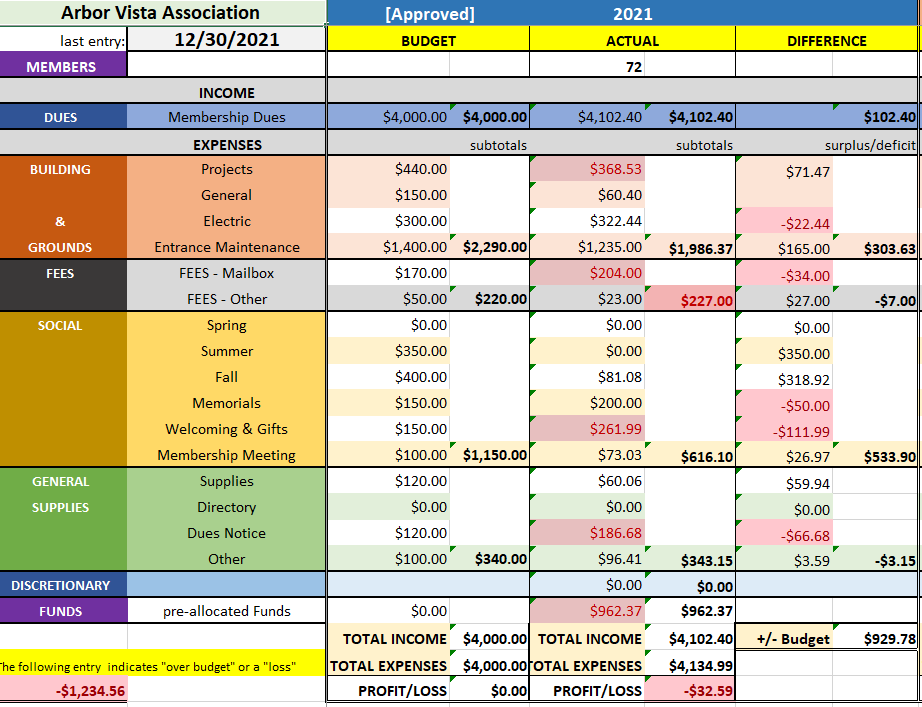
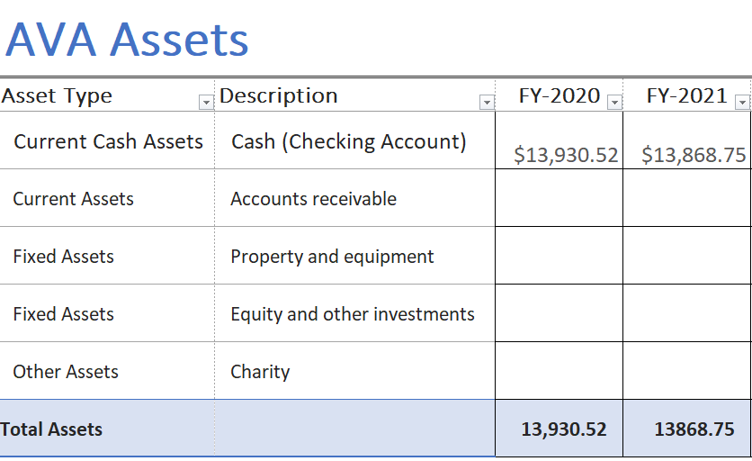
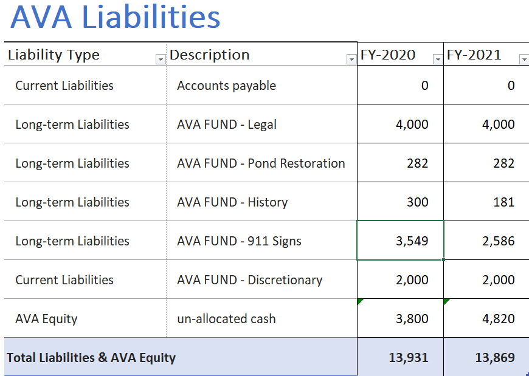

<link id="linkstyle" rel='stylesheet' href='/css/lodge-gray.css'/>

 
 

[Logo]: /images/Oak_Tree2_100.png
# ![Logo] 💰2022 AVA Annual Meeting Treasurer Report

## Project 

 -  Implemented PayPal payment system

## Membership (as of 12/31/2021)

- **73**   AVA Members (74 in 2020)

## Checking Account (as of 12/31/2021)

- **$ 13,869**  Checking Account: (  $13,931 12/30/2020)
- **7**  PayPal Memberships Received

## Budget (as of 12/31/2021)

- **$901**  Surplus
  - **$534**   due to cancellation of most Social Events
  - **$274**   Building & Grounds
  - **$0**   Discretionary Fund Expenditures
-  _911 Sign Project_
  - **$838**   Money Spent This Year
  - **$2586/$4500**   Funds Remaining

## Assets

## Liabilities

## Balance Sheet

---

