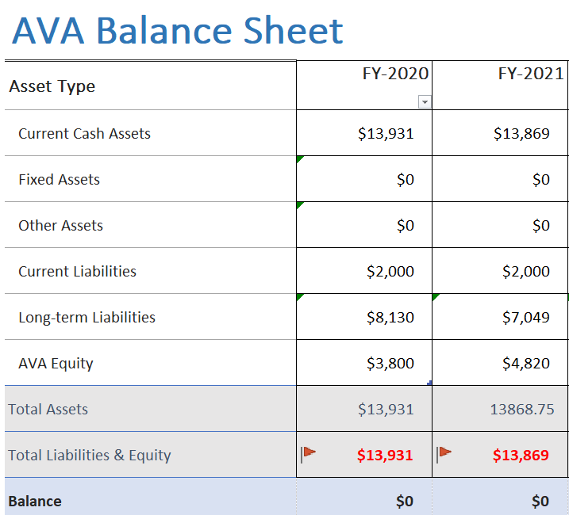

<link id="linkstyle" rel='stylesheet' href='/css/ava.css'/>

[Logo]: /images/Oak_Tree2_100.png
# ![Logo] 💰2022 AVA Annual Meeting Treasurer Report

## Project 

!!!  Implemented PayPal payment system

## Membership

!!! - **72**   AVA Members (74 in 2020)

 ## Sign Installation
 
!!!   - **$838**   Money Spent This Year
!!!   - **$2710/$4500**   Funds Remaining

## Checking Account

!!!   - **$ 13,869**  Checking Account: (  $13,931 12/30/2020)
!!!   - **7**  PayPal Memberships Received

## Budget

!!!  - **$901**  Surplus
!!!    - **$534**   due to cancellation of most Social Events
!!!    - **$274**   Building & Grounds
!!!    - **$0**   Discretionary Fund Expenditures
!!!  -  _911 Sign Project_
!!!    - **$838**   Money Spent This Year
!!!    - **$2710**   Funds Remaining

## Balance Sheet

## Assets

## Liabilities

---

