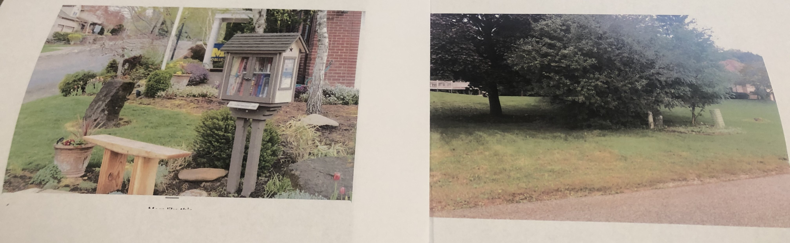
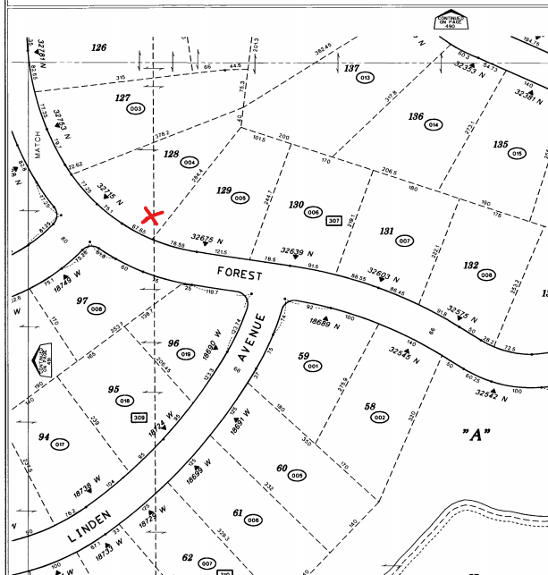

# Little Free Library

## an Eagle Scout Project by Louka Graff

My idea for the Little free library project comes from growing up in this neighborhood with the bookmobile. Since we no longer have the bookmobile, I thought it would be great to provide an ongoing love of reading with a little free library. The idea is a free book exchange where someone can take a book and then leave a book. They function on the honor system and you don’t always have to leave a book. We have someone that can donate books at all times if it is ever low. 

I plan to register the library to [littlefreelibrary.org](https://littlefreelibrary.org/), where it will appear on the LFL world map. I will maintain the library while I live here which can be taken over by my parents. I plan to build a bench and  plant some flowers around the LFL. We can advertise the library on the next door app as well as LFL.org. Below is a better picture of an example. It will have the same structure, but different colors. Feel free to also visit littlefreelibrary.org

Louka Graff 

## Arbor Vista Little Free Library Location

---
