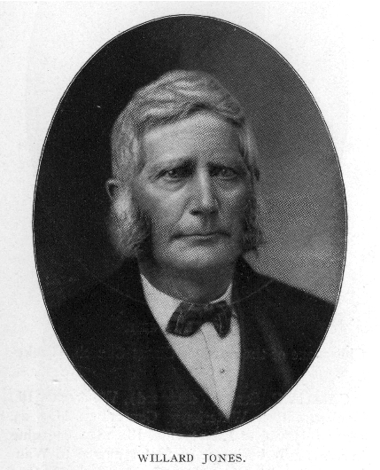
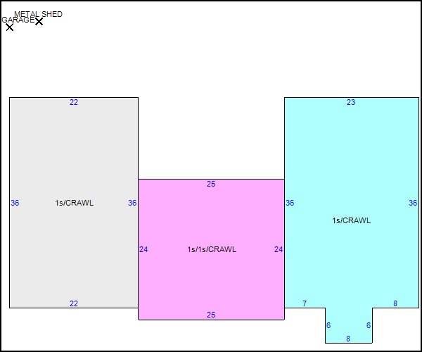

# Timeline for the Arbor Vista area 
### **[Arbor Vista Subdivision]**
- SW corner of Section 31 Warren Township, Lake County, Illinois
- Section 31; Township 45 North; Range 11; East of the Third Principal Meridian, State of Illinois
- Absolute SW corner of Warren Township, Lake County, Illinois; USA
- Legal: ROBERT BARTLETTS ARBOR VISTA
- Tax Code Area: 08066 - WARREN TWP 066
### Pre - 1818
-  Illinois River [Potawatomi](https://en.wikipedia.org/wiki/Potawatomi) Indians until August 1829, when economic and resource pressures forced the tribe to sell much of their land in northern Illinois to the U.S. government for $12,000 cash, an additional $12,000 in goods, plus an annual delivery of 50 barrels of salt.
### 1818 
- [Illinois](https://en.wikipedia.org/wiki/Illinois) became the 21st U.S. state
### 1829
- [Waukegan](https://en.wikipedia.org/wiki/Waukegan%2C_Illinois) established - named: Potawatomi: wakaigin  (Fortress or Little Fort)
### 1835
-  [Willard Jones](https://www.findagrave.com/memorial/88081931/willard-jones) (36) stakes a claim for a 160 acre homestead, built a log house on what is now known as Arbor Vista of Lot 31 Warren Township
- 
- [Cook County](https://en.wikipedia.org/wiki/Cook_County%2C_Illinois) established (included land now in Lake  and McHenry County)
### 1836
- Village of Independence Grove (now [Libertyville](https://en.wikipedia.org/wiki/Libertyville%2C_Illinois)) established
- [McHenry County](https://en.wikipedia.org/wiki/McHenry_County%2C_Illinois) established (included land now in Lake County)
### 1837
- Independence Grove name changed to [Libertyville](https://en.wikipedia.org/wiki/Libertyville%2C_Illinois)
- [Libertyville](https://en.wikipedia.org/wiki/Libertyville%2C_Illinois) Post Office established
### 1839
- [Libertyville](https://en.wikipedia.org/wiki/Libertyville%2C_Illinois) re-named Burlington
- Burlington/Libertyville named county seat
- [Lake County](https://en.wikipedia.org/wiki/Lake_County%2C_Illinois) established present day borders
### 1840
- [Grayslake](https://en.wikipedia.org/wiki/Grayslake%2C_Illinois) settled
### 1841 
- [Waukegan](https://en.wikipedia.org/wiki/Waukegan%2C_Illinois) named county seat
- Burlington re-named back to Libertyville
### 1842
- 7/2/1842 Willard Jones purchases 40 acres @ 1.25 acre for total of \$50.00
- 6/1/1842 Willard Jones purchases 187 acres \@1.25 acre for total of \$234.48
- [Judge ][DeWitt Jones](https://www.findagrave.com/memorial/24853240/dewitt-lane-jones) [born on Jones homestead in Arbor Vista]
- 
### 1843
- Half Day Inn established
### 1847    
- [4 Jones children pass away due to scarlett fever]
- [Hainesville](https://en.wikipedia.org/wiki/Hainesville%2C_Illinois) becomes incorporated
### 1848
- [Lake & McHenry Plank Road (now Route 120) begins planning stage](https://patch.com/illinois/grayslake/from-the-grayslake-historical-society-archives-plank-roads)
### 1849
- [Jennie Jones Ford](https://www.findagrave.com/memorial/24811291/jennie-m-ford) is born in Arbor Vista
- [Waukegan](https://en.wikipedia.org/wiki/Waukegan%2C_Illinois) Incorporated as a town
- [Avon Township](https://en.wikipedia.org/wiki/Avon_Township%2C_Lake_County%2C_Illinois) , [Libertyville Township](https://en.wikipedia.org/wiki/Libertyville_Township%2C_Lake_County%2C_Illinois) established
- [Warren Township](https://en.wikipedia.org/wiki/Warren_Township%2C_Lake_County%2C_Illinois) established  by settlers who came from the town of [Warren, New York](https://en.wikipedia.org/wiki/Warren%2C_New_York)
### 1850
- Census
### 1851 
- Lake and McHenry Plank Road is completed from Waukegan to Hainesville
### 1859
- [Waukegan](https://en.wikipedia.org/wiki/Waukegan%2C_Illinois) Incorporated as a city
### 1860
- Census 
- 2 Jones children pass away due to scarlett fever
### 1861
- American Civil War begins
### 1864
- DeWitt Jones(22) enlists in Company D, 146th Illinois Infantry,
### 1865
- American Civil War ends
- DeWitt Jones was an escort for the President Lincoln funeral cortege
- DeWitt Jones returns from Civil War
### 1870
- Census
### 1877
- Lake and McHenry Plank Road ceases operation
### 1880
- Census
### 1886
- Wisconsin Central railroad station in Grayslake completed
- [Grayslake](https://en.wikipedia.org/wiki/Grayslake%2C_Illinois) platted as a subdivision
- Fourth class post office established in Grayslake
### 1867
- DeWitt Jones married Ella Burrows in Grayslake
### 1872
- Willard Jones (72) passes away
### 1870
- George Jones born to DeWitt and Ella
### 1875
- Ella Burrows Jones passes away
### 1872
- Fred Chard (1872-1945) born / owned Arbor Vista / fire chief of Grayslake
### 1879
- [Libertyville](https://en.wikipedia.org/wiki/Libertyville%2C_Illinois)\'s Cook Mansion built Ansel Brainerd Cook
### 1885
### 1885 Atlas 
- Orpha Jones owner of Arbor Vista 124 Acres
- Jennie M Ford
### 1887
- Willard Jones homestead destroyed by fire
- Marcia Jones/wife of Willard (77) passes away
- Jennie Jones Ford/daughter of Willard and her husband Warren Ford take possession of Jones Homestead
### 1890
- Census
### 1895
- [Grayslake](https://en.wikipedia.org/wiki/Grayslake%2C_Illinois) incorporated as a village
- Frame school house moved to Whitney Street and became village hall
### 1897
- Electric lights started to be installed in business section
### 1898
- Local phone service started
### 1899
- Long distance phone service began
- Chicago, Milwaukee, and St. Paul Railroad put in line
- F.C. Wilbur Lumber Company burned
- Grayslake Fire Department organized
### 1900
- Grayslake had 416 residents
- Census
### 1907
### [per map / owners of Arbor Vista](https://rhoppel.github.io/arborvista_history/maps/1907-warren_township.png)
- Fred Chard (124 acres) \[1907 Atlas\]
- W.S. Hawthorn (36 acres ???)
### 1913
- [[Dobe Commercial Building](http://www.tax.lakecountyil.gov/datalets/datalet.aspx?mode=residential&sIndex=1&idx=1&LMparent=20) built (who was the original owner?)]
- []
- []
### 1916
- DeWitt Jones (73) passes away
### 1918
- Center Avenue (present day Lake Street) paved
### 1920
- Grayslake had 736 residents
### 1925
- Fred Dobe moves to Grayslake/Arbor Vista
- 
### 1926
- [32291 N Pine ][Dobe Estate House](http://www.tax.lakecountyil.gov/datalets/datalet.aspx?mode=residential&sIndex=7&idx=1&LMparent=20) [Built  (remodeled 1936)]
- []
- []
### 1929
- [32784 N Forest Dobe](http://www.tax.lakecountyil.gov/datalets/datalet.aspx?mode=residential&sIndex=0&idx=1&LMparent=20) Estate (stable???)
- 
- 
### 1930
- [[32280 N Pine - Dobe Estate Caretaker House](http://www.tax.lakecountyil.gov/datalets/datalet.aspx?mode=residential&sIndex=5&idx=2&LMparent=20) built]
- []
- []
### 1937
- [[Liberty Theater opens in Libertyville - owned by Fred Dobe](https://shelflife.cooklib.org/2017/01/25/lets-all-go-to-the-movies-the-storied-history-of-the-libertyville-theater/)]
- []
### 1939
- Illinois takes aerial photographs of entire state
- [Dobe Estate/Arbor Vista](https://rhoppel.github.io/arborvista_history/maps/1939-7-20-estate_house_.png)
### 1940
### [Leo DeMeyer](https://www.legacy.com/obituaries/lake-county-news-sun/obituary.aspx?pid=91079798) establishes [Grayslake Feed](https://www.grayslakefeed.com/our-history)
### 
### Census
- Fred Dobe (69) tree expert/tree farm, Marie Dobe (72), Johanna (44)
### 1949
- [Grayslake Outdoor Family Theater opens - owned by Fred Dobe]
- 
### 1959
- [32225 N Pine](http://www.tax.lakecountyil.gov/datalets/datalet.aspx?mode=residential&sIndex=3&idx=2&LMparent=20) Built
- 
- 
### 1960
- [Frederic W. Dobe passes away]
- [[32814 N FOREST DR](http://www.tax.lakecountyil.gov/datalets/datalet.aspx?mode=residential&sIndex=7&idx=1&LMparent=20)  Bartlett Model Home]
- []
- []
### 1962
- [32176 N Pine - Leo DeMeyer Home](http://www.tax.lakecountyil.gov/datalets/datalet.aspx?mode=residential&sIndex=2&idx=2&LMparent=20) Built
- 
- 
### 1990
- [Almond Marsh Nature](https://www2.illinois.gov/dnr/INPC/Pages/Area2LakeAlmondMarsh.aspx) Preserve established
### 2007
- Leo B DeMeyer passes   [findagrave](https://www.findagrave.com/memorial/20565764/leo-b-demeyer)  [obit](https://www.legacy.com/obituaries/lake-county-news-sun/obituary.aspx?pid=91079798)

