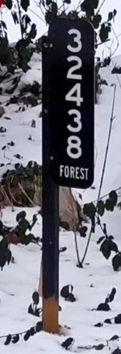
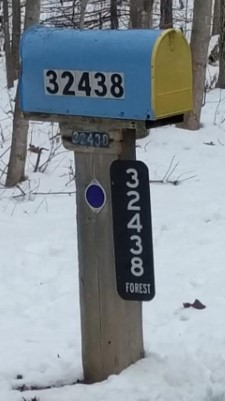
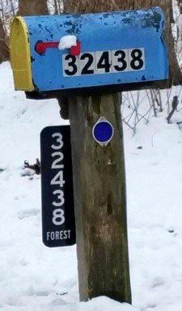
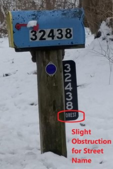
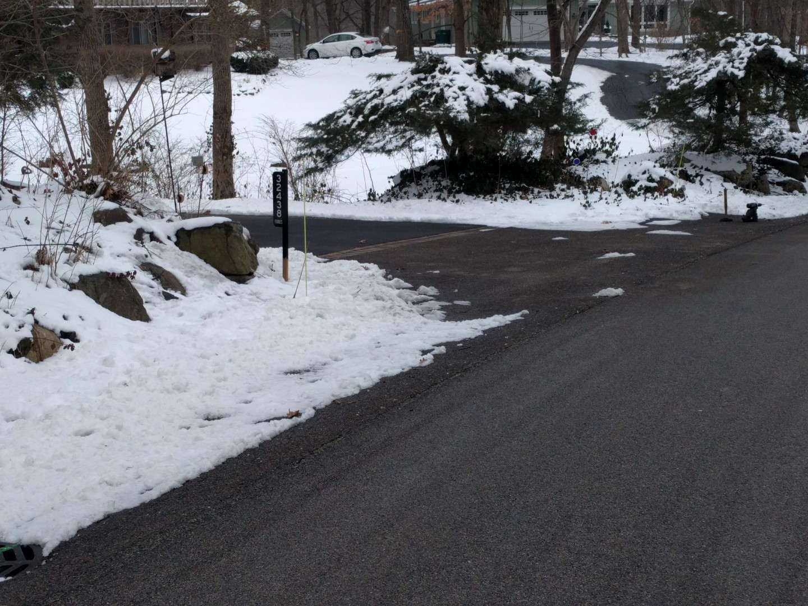
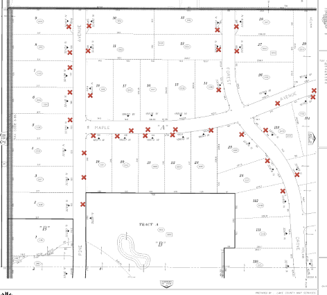
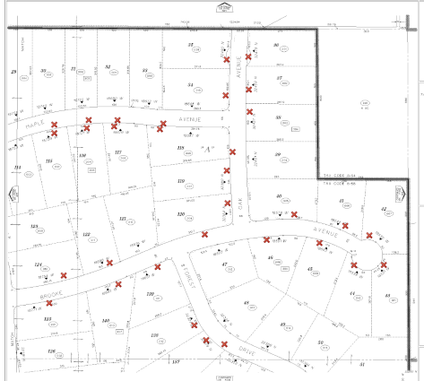
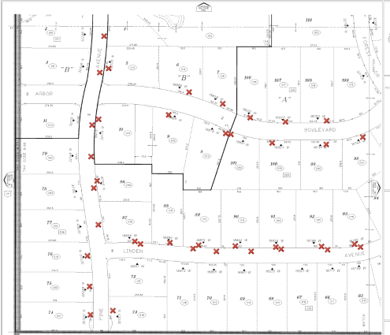
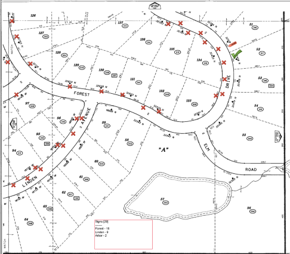

## AV 911 Driveway Signage
!!! - [__AV 911 Signage Project Plan__](https://1drv.ms/x/s!AmlRt1Ah7vyImdVjxxdvzQRRlQrMNw)
!!! - __Status:__ Waiting for AVA budget allocation
!!! - __Objective:__ Install clearly visible home number with street name signage near the driveway entrance of each home through-out the neighborhood.
!!! - __Project Manager:__ Richard Hoppel [rhoppel@gmail.com; mobile 847.400-7505]

!!!! - [__The APPROVED sign for this project from SmartSign__](http://bit.ly/2TW2FLG)

!! - __Early Bird Adopters:__ Sign up at the AVA Annual Meeting!

` click on image for larger version`

Side | <mark>the approved sign</mark> | <mark>sign on post (preferred)</mark> | <mark>sign on mailbox</mark> | <mark>sign on back of mailbox</mark>
:---: |:---: |:---: | :---: | :---:  
Front| |  | | 
Back| |  | | 

## Driveway sign on a typical driveway

!!! - __Preferred Location:__ at the entrance of the driveway
!!! - Double-Sided Aluminum sign is Highly Visible at Night
!!! - Mounting post made of composite material for durability
!!! - the sign post be mounted on back side of post towards same-sided oncoming traffic for best visibility for opposite-side traffic (see photos)
!!! - Free for <mark>AVA Members</mark> in good standing at `No Cost`
!!! - Installed for a price for non-AVA members
!!! - [JULIE must be contacted for installation of a new post ](https://www.illinois1call.com/)
!!! - [JULIE E-request](https://www.illinois1call.com/e-request-helpful-tips/)

### FAQ

- Why is is this happening?
  - _We would like for 911 calls to result in emergency services arriving at the correct __driveway__ location.  Driveway locations can be __VERY__ different from the mailbox locations and __VERY__ confusing.  Arbor Vista has never had consistent signage.  It is difficult to find house numbers and streets for non-residents, especially at night.  Also, the Lake County Sheriff officers have had discussions with us about difficulty finding locations in Arbor Vista.  Google maps does not always locate proper house addresses because mailbox and driveways are not registered in their database. Your houseguests will appreciate the clearly marked driveway signs!_
- My mailbox clearly marks my driveway.  What is the problem?
  - _You are in the minority.  Many mailboxes are on the opposite side of the property and not even near the driveways.  Several driveways are not even on the same street as the mailbox.  Many mailbox locations have two mailboxes. The number clarity on many mailboxes is very poor.  The mailboxes are laid out for the convenience of the US Post Office in numerical order, not indicating the closest driveway.  You can review the maps below indicating the mailbox locations. [Red boxes indicate the mailbox locations]_
- Do I have to have a sign installed?
  - _No. Signs will __ONLY__ be installed after an approval and review with the homeowner._ 
-  When will a sign be installed?
  - _When __YOU__ make contact with the Project Manager and arrange an installation._
-  How much will it cost?
  - _It is __FREE__ for Arbor Vista Association members in good standing (Your dues are paid for 2019 and 2018.). Others will have to pay a fee._ 
- I am not a AVA member.  Can I get a sign?
  - _It can be installed for a fee. The cost is TBD.  Consider joining the AVA so you can get a sign installed for free!_
-  Where will the sign be installed?
   - _The recommended location is on a post next to the driveway entrance of your choice (many driveways have two entrances). The sign can be your choice of the right or left side of the driveway as __"viewed from the street"__.  An alternative would be mounted to your mailbox post. For many homes the driveway is not that close to the mailbox.  Therefore the mailbox is a preferred choice._
-  Can I install it somewhere else?
  - _Possibly.  Alternatives need to be approved by the Project Manager_
- Why not only put the sign on mailbox posts?
  - _The mailbox location does not always clearly mark where the correct driveway is located which leads to confusion.  A house number sign located at the end of the driveway near the street is the best location for clarity. On some streets mailboxes are only on one side of the street while others use both sides.  The mailbox side is not consistent in Arbor Vista._
-  Can I install it myself?
  - _We are trying to install the signs in a consistent manner throughout the neighborhood. Ideally we would like to install the sign to maintain a consistent presentation, but under special circumstances we could allow the homeowner to complete installation with final approval of the Project Manager._
- Who is managing this project?
  - _Richard Hoppel and the Arbor Vista Association Buildings and Grounds manager_
- Do I have to contact any authorities beforehand?
  - _Probably.  If a post is to be installed,  JULIE must be contacted before installing the post.  The Warren Township Highway Dept. insists on this._
- What does the Warren Township Highway Department think about this?
  - _They totally approve of the concept and are working with us to provide an ideal installation.  We will continue to work closely with them during the planning and implementation phase._ 
- Can I get a replacement sign if it is damaged?
  - _Yes, for a fee. Or you can use the link above to order your own sign_
- Does the US Post Office have regulations concerning mailboxes?
  - _Yes. [USPS Mailbox Regulations](https://www.mailboss.com/guide-usps-mailbox-regulations/)_
- Do the USPS Regulations conflict with this project?
  - _No.  USPS require 1" letters mounted on the box or post.  This sign will fulfill this requirement._
- Why choose the sign from SmartSign?
  - _Many alternatives have been reviewed and this is the best choice.  The sign is very visible and readable at night, very customized attractive layout, well-made and durable 2-sided aluminum with 3M materials, reasonably priced, and it is easy to order with very fast delivery (a couple of days).  Customer service is outstanding._ 
- What is the post made of?
  - _[<mark>Under evaluation</mark>] Currently the plan is to us a 1" x 2" composite material about 4 feet in length.  The post would extend 2 feet into the ground to prevent freezes from moving the sign. This would provice a very sturdy stucture for the sign and it is more attractive than a metal post.  Metal alternatives will be evaluated when we review some samples.  The final solution needs to be cost-effective, attractive (at least compared to the alternatives), easy to install and durable while maintaining a vertical position._

### Mailbox and House Number Sign Locations Progress
!!! - A __`Red` :fa-times:__ on a property boundary marks the approximate mailbox location physically located on that homeowner's property.  
!!! - A __`Red` :fa-times:__ in the street indicates that this mailbox is located on the opposite side of the street and not physically located on the !!! homeowners property.  
!!! - A __Green__ :fa-check: indicates that a sign has been installed and the approximate location.

`Click on a map for a larger version`

| NW | NE |
|:----:|:----:|
|| |
| **SW** | **SE** |
|| |
---
